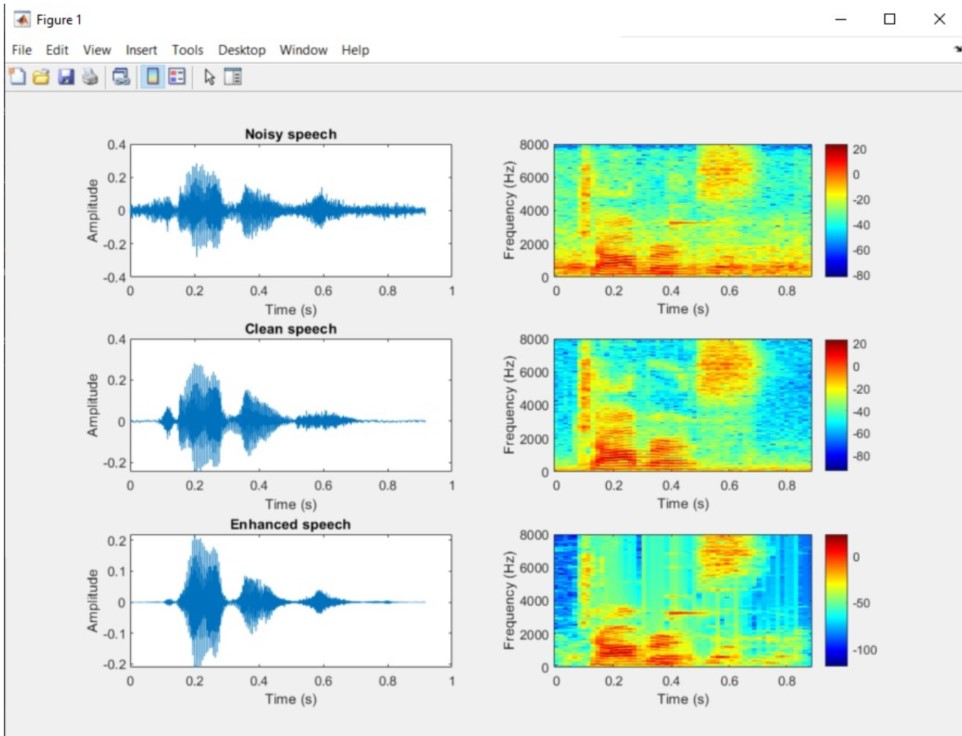

# MATLAB-Noise-Reduction-by-wiener-filter
Noise cancellation, suppression, Speech enhencement

## The program does the following: 
  - Speech enhancement / Noise cancellation and suppression
  - A convex combination of two DD approaches
  - Minimum mean squared error (MMSE) to estimate desired speech signal

## Output
  

## To replicate: Run the P code

  
